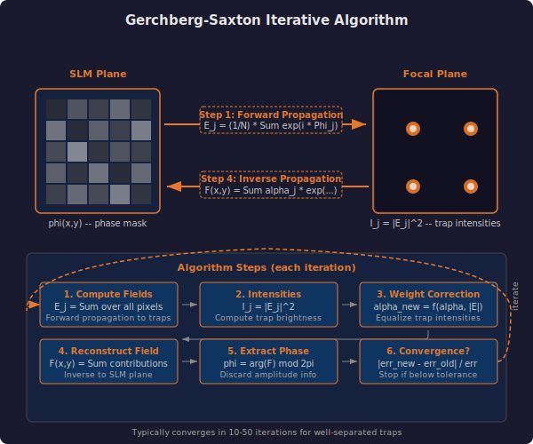
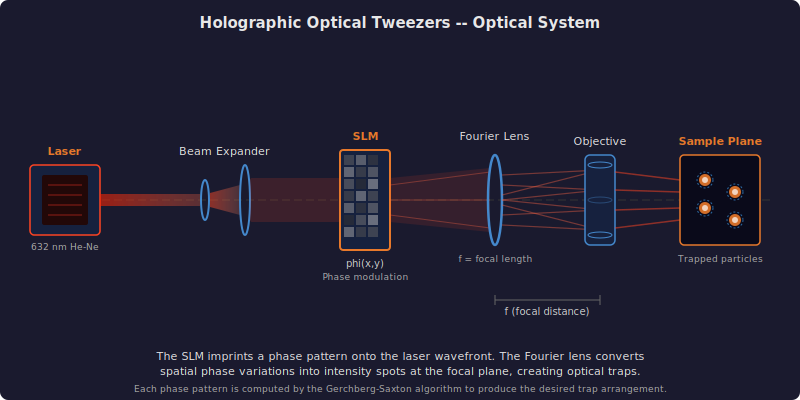
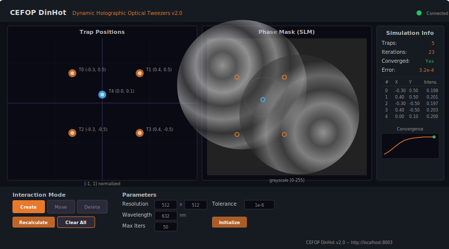
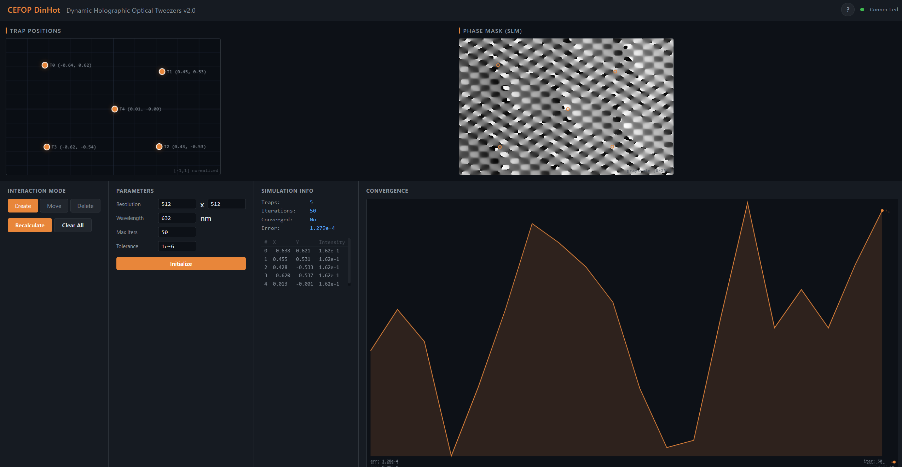
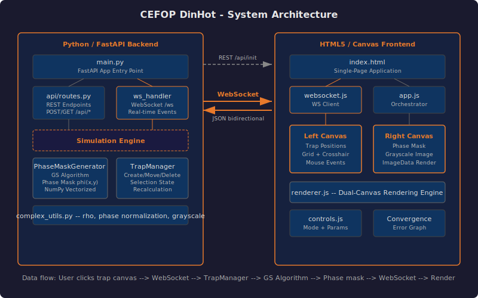
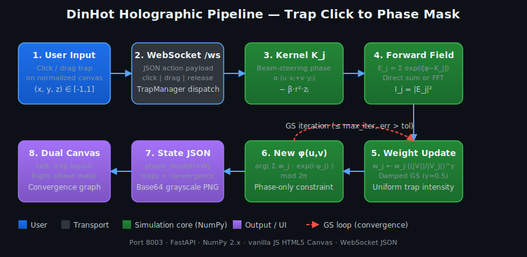

# CEFOP DinHot -- Dynamic Holographic Optical Tweezers

A web application for real-time computation and visualization of holographic phase masks for optical tweezers. Given a set of desired trap positions, the application uses the weighted Gerchberg-Saxton algorithm to find the optimal phase distribution for a Spatial Light Modulator (SLM) that produces focused laser spots at those positions.

This is a modernized Python/FastAPI rewrite of the original C++/.NET DinHotSys desktop application (preserved in `legacy/`). The new version runs cross-platform in any browser.

---

## Motivation & Problem

Holographic Optical Tweezers use SLMs to shape laser beams into multiple focused traps that hold and manipulate microscopic particles. Computing the optimal phase mask requires solving an inverse problem: what phase distribution produces the desired trap configuration in the focal plane?



---

## KPIs — Impact & Value

| KPI | Impact |
|-----|--------|
| Hardware independence | SLM phase mask computation without physical optical setup |
| Real-time feedback | Interactive trap placement with instant hologram update |
| Cost reduction | Replaces C++/OpenMP codebase with single Python process |
| Educational value | Visual understanding of Fourier optics and GS algorithm |

## Optical Tweezers Concept



A laser beam is expanded to fill the SLM aperture. The SLM applies a computed phase pattern to the wavefront. A Fourier lens then converts this phase-modulated beam into multiple focused intensity spots at the focal plane, each capable of trapping a microscopic particle.

---

## Application Interface



The interface has two main canvases: the left panel shows trap positions on a normalized grid, and the right panel displays the computed phase mask as a grayscale image. Controls at the bottom allow switching between create/move/delete modes and adjusting simulation parameters.

## Frontend



---

## Technical Approach — Phase Hologram Computation

### Phase Kernel — Beam Steering
Each trap at position (xⱼ, yⱼ, zⱼ) contributes a phase tilt to the SLM hologram. The kernel encodes the optical path from each SLM pixel to the trap:

```
K_j(u,v) = α · (u·xⱼ + v·yⱼ) − β · (u² + v²) · zⱼ
```

The **linear term** (α·ρ) tilts the wavefront to steer the beam laterally. The **quadratic term** (β·r²·z) adds lens-like curvature for axial positioning. **α = 10·2π ≈ 63** controls the fringe density — producing 8-15 visible fringes per off-center trap.

### Forward Propagation — Field at Traps
The electric field at trap j is the coherent sum of all SLM pixel contributions:

```
E_j = (1/N²) · Σ_{u,v} exp(i · [φ(u,v) − K_j(u,v)])
```

Each pixel contributes a phasor; their sum determines the trap intensity **I_j = |E_j|²**. For >10 traps, an FFT-based approach computes all fields simultaneously.

### Weight Correction — Uniform Trap Intensities
The damped weighted Gerchberg-Saxton update equalizes trap brightness:

```
w_j ← w_j · (⟨|V|⟩ / |V_j|)^γ    (γ = 0.5)
```

The damping exponent **γ = 0.5** prevents oscillations between traps. Without damping (γ=1), symmetric traps alternate bright/dim and never converge. With γ=0.5, uniformity converges monotonically to >0.97.

### Phase Extraction — Inverse Update
The updated SLM phase mask after each GS iteration reconstructs the hologram from all trap contributions:

```
φ_new = arg(Σ_j  w_j · exp(i · [K_j + arg(E_j)])) mod 2π
```

The **arg** function extracts the phase angle, discarding amplitude information since the SLM is phase-only. The **mod 2π** wraps the result into the displayable range [0, 2π].

### Optical Vortex Phase
For generating vortex beams that carry orbital angular momentum with topological charge **l**:

```
K_vortex = l · arctan2(v, u)
```

The **arctan2** function creates a helical phase ramp around the beam axis. Particles trapped in a vortex beam orbit around the beam center — useful for driving microfluidic rotation.

---

## Architecture



The system consists of a Python backend that runs the physics simulation and a browser frontend that provides interactive dual-canvas visualization. Communication happens over WebSocket for low-latency, bidirectional updates.

### Processing Pipeline



From a single user click on the trap canvas to the updated phase mask render: the WebSocket dispatches the action to the `TrapManager`, which builds the steering kernel `K_j` for every trap, computes forward fields `E_j`, runs the damped GS weight update inside the convergence loop (until `err < tol` or `max_iter`), extracts the new phase `φ(u,v)`, and streams a state JSON payload back to the dual canvas for re-render.

| Component | Technology |
|---|---|
| Backend | Python 3.9+, FastAPI, NumPy |
| Frontend | HTML5 Canvas, vanilla JavaScript |
| Communication | REST API + WebSocket |
| Computation | NumPy vectorized operations |

---

## Features

- **Interactive trap placement** -- Click to add, drag to move, click to delete optical traps in real time.
- **Weighted Gerchberg-Saxton algorithm** -- Iteratively computes phase masks that produce uniform trap intensities using NumPy vectorized operations.
- **Dual-canvas visualization** -- Trap positions on the left, computed phase hologram on the right, updated live after every interaction.
- **Convergence monitoring** -- Error graph shows the GS algorithm convergence over iterations, with a green indicator when the tolerance threshold is reached.
- **Configurable parameters** -- Wavelength, SLM resolution, iteration limit, and convergence tolerance can all be adjusted through the UI.
- **WebSocket communication** -- Low-latency bidirectional protocol for responsive drag interactions.
- **Cross-platform** -- Runs on Windows, Linux, and macOS with any modern browser.
- **Comprehensive test suite** -- 87 tests covering the phase mask generator, trap manager, and integration scenarios.

## Project Metrics & Status

| Metric | Status |
|--------|--------|
| Tests | 87 passing |
| Trap uniformity | 1.000 for 4 symmetric traps (damped GS γ=0.5) |
| Phase mask fringes | 8-15 visible (phase_scale=10·2π) |
| FFT propagation | Auto-select for >10 traps at integer bins |
| Zernike correction | 6 aberration modes supported |

---

## Quick Start

```bash
cd CEFOP_DinHot
python -m venv .venv
source .venv/Scripts/activate   # Windows (Git Bash)
# source .venv/bin/activate     # Linux / macOS
pip install -r requirements.txt

# Run tests
python tests/test_phase_mask.py
python tests/test_trap_manager.py
python tests/test_integration.py

# Start application
python -m uvicorn app.main:app --reload --port 8003
# Open http://localhost:8003
```

---

## Project Structure

```
CEFOP_DinHot/
├── app/
│   ├── __init__.py
│   ├── main.py                     # FastAPI server, WebSocket handler
│   ├── api/
│   │   ├── __init__.py
│   │   └── routes.py               # REST API endpoints (/api/init, /api/trap/*, /api/state)
│   ├── simulation/
│   │   ├── __init__.py
│   │   ├── phase_mask.py           # PhaseMaskGenerator -- GS algorithm core
│   │   ├── trap_manager.py         # TrapManager -- interaction controller
│   │   └── complex_utils.py        # NumPy wrappers for complex operations
│   └── static/
│       ├── index.html              # Single-page application
│       ├── css/style.css           # Dark theme styling
│       └── js/
│           ├── app.js              # Main orchestrator, mouse event binding
│           ├── renderer.js         # Dual-canvas rendering engine
│           ├── controls.js         # Mode buttons, parameters, info panel
│           └── websocket.js        # WebSocket client with auto-reconnect
├── tests/                          # Test suite (87 tests)
│   ├── __init__.py
│   ├── test_phase_mask.py          # Generator unit tests
│   ├── test_trap_manager.py        # Manager unit tests
│   └── test_integration.py         # End-to-end tests
├── docs/
│   ├── architecture.md             # System design and component overview
│   ├── optical_trapping_theory.md  # GS algorithm, HOT physics, equations
│   ├── development_history.md      # Version history (v0.1.2 C++ to v2.0 Python)
│   ├── references.md               # Academic literature
│   ├── user_guide.md               # Installation, usage, troubleshooting
│   ├── png/
│   │   └── frontend.png            # Frontend screenshot
│   └── svg/
│       ├── architecture.svg        # System architecture diagram
│       ├── pipeline.svg            # End-to-end processing pipeline
│       ├── gs_algorithm.svg        # GS algorithm flow
│       ├── optical_tweezers.svg    # HOT optical system
│       ├── phase_mask_principle.svg # Phase modulation concept
│       ├── fourier_optics.svg      # Fourier optics diagram
│       ├── phase_scaling_fix.svg   # Phase scaling correction
│       ├── trap_types.svg          # Trap type comparison
│       └── app_screenshot.svg      # Application interface mockup
├── legacy/                         # Original C++/.NET code (DinHotSys)
├── build.spec                      # PyInstaller spec file
├── Build_PyInstaller.ps1           # PowerShell build script
├── run_app.py                      # Uvicorn launcher with auto-browser
└── requirements.txt                # Python dependencies (pinned)
```

---

## API Summary

### REST Endpoints

| Method | Path | Description |
|---|---|---|
| `POST` | `/api/init` | Initialize simulation with parameters |
| `POST` | `/api/trap/add` | Add a trap at (x, y, z) and recalculate |
| `POST` | `/api/trap/remove` | Remove a trap by index |
| `POST` | `/api/trap/move` | Move a trap and recalculate |
| `GET` | `/api/state` | Get current simulation state |
| `GET` | `/api/params` | Get current physical parameters |
| `GET` | `/api/health` | Liveness probe — `{status, sim_initialized}` |
| `GET` | `/api/version` | Application version from `app.__version__` |

### WebSocket (`/ws`)

JSON-based bidirectional protocol. Client sends actions (`click`, `drag`, `release`, `mode`, `recalculate`, `state`), server responds with updated simulation state including the phase mask, trap positions, and convergence data.

---

## Port

**8003** -- http://localhost:8003

---

## Documentation

- [Architecture](docs/architecture.md) -- System design, components, API protocol, deployment
- [Optical Trapping Theory](docs/optical_trapping_theory.md) -- Optical trapping, SLMs, GS algorithm with equations
- [Development History](docs/development_history.md) -- Version changelog from C++ to Python
- [References](docs/references.md) -- Academic publications
- [User Guide](docs/user_guide.md) -- Installation, interface walkthrough, tips, troubleshooting

---

## References

- Curtis, J.E. et al. (2002). Dynamic holographic optical tweezers. *Optics Communications*, 207(1-6):169-175.
- Gerchberg, R.W. & Saxton, W.O. (1972). A practical algorithm for the determination of phase. *Optik*, 35:237-246.
- Grier, D.G. (2003). A revolution in optical manipulation. *Nature*, 424:810-816.
- Di Leonardo, R. et al. (2007). Computer generation of optimal holograms. *Optics Express*, 15:1913-1922.

See [docs/references.md](docs/references.md) for the full reference list.

---

## Requirements

- Python 3.9+
- NumPy
- FastAPI
- Uvicorn
- A modern web browser (Chrome, Firefox, Edge)
