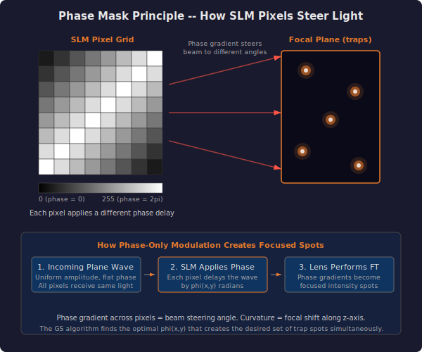
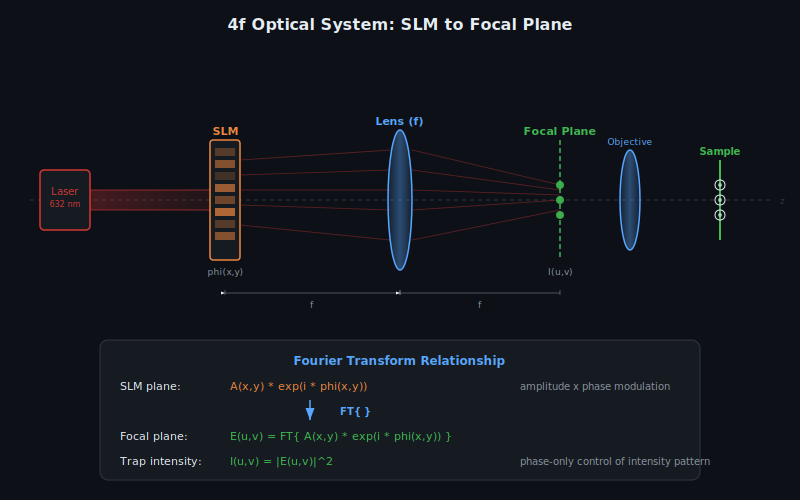
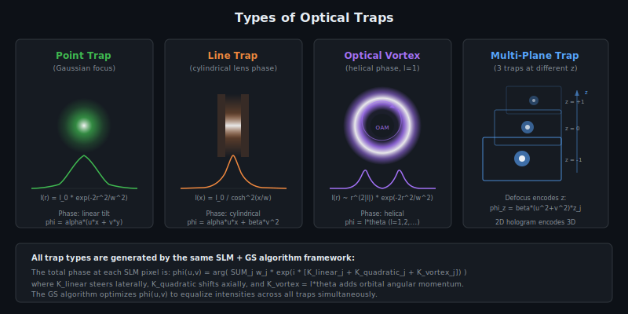

# Physics Model

## Optical Trapping Principles

When a tightly focused laser beam passes through a transparent microscopic particle (such as a glass bead or a biological cell), the particle experiences forces that push it toward the region of highest light intensity. This happens because the particle bends the light rays as they pass through it, and by Newton's third law, the light pushes back on the particle. If the beam is focused sharply enough, the restoring force toward the focal point dominates over the forward scattering force, and the particle becomes trapped in three dimensions near the beam waist.

This phenomenon is the basis of optical tweezers: a single focused laser beam can hold and move a microscopic object without any physical contact. The trapping force has two contributions:

- **Gradient force** -- Arises from intensity gradients in the focused beam. It pulls the particle toward the brightest region (the focal point). This is the force responsible for stable trapping.
- **Scattering force** -- Arises from momentum transfer when photons scatter off the particle. It pushes the particle along the beam propagation direction. A tightly focused beam minimizes this relative to the gradient force.

For trapping to work, the gradient force must exceed the scattering force. This is achieved by using a high numerical aperture (NA) objective lens to create a very tight focus.

## Spatial Light Modulators

A Spatial Light Modulator (SLM) is a programmable optical device that can modify the phase (and sometimes amplitude) of a light beam on a pixel-by-pixel basis. In the context of optical tweezers, a reflective liquid-crystal SLM is placed in the beam path before the focusing optics.

Each SLM pixel acts as a tiny adjustable delay element. By applying a voltage to the liquid crystal layer at each pixel, the local refractive index changes, which shifts the phase of the transmitted or reflected light. The result is a spatially varying phase pattern imprinted onto the beam's wavefront.

The key property exploited here is that the SLM modifies only the phase of the light, not its amplitude. The incoming beam remains uniform in brightness across the SLM aperture, but different regions of the beam acquire different phase delays. When this phase-modulated beam passes through a lens, the Fourier transform relationship between the SLM plane and the focal plane converts the spatial phase variations into an intensity pattern -- the optical traps.



## Phase-Only Holograms

A phase-only hologram is a two-dimensional map of phase values that, when applied to a uniform laser beam, produces a desired intensity distribution in the far field (or equivalently, at the focal plane of a lens). Unlike amplitude holograms, which block some of the light to create patterns, phase-only holograms redirect all the incoming light by changing its direction through local phase tilts. This makes them far more efficient -- nearly all the laser power ends up in the trap spots rather than being absorbed.

The challenge is that we want to control the intensity pattern (where the bright spots appear and how bright they are), but we can only control the phase at the SLM. The amplitude in the SLM plane is fixed (uniform illumination). This constraint makes the problem non-trivial: there is no closed-form solution for the optimal phase pattern when multiple traps are desired. Instead, iterative algorithms are needed.

The SLM applies a phase:

```
phi(x,y) in [0, 2*pi)
```

where (x, y) are the pixel coordinates on the SLM. Black pixels (phase = 0) leave the beam unchanged; white pixels (phase = 2*pi, which wraps back to 0) represent a full wave of delay.

## The Gerchberg-Saxton Algorithm

The Gerchberg-Saxton (GS) algorithm is an iterative procedure for finding a phase distribution that produces a desired intensity pattern. It was originally developed for electron microscopy but has become the standard tool for computing holograms for optical trapping.

The core idea is to bounce back and forth between two planes -- the SLM plane and the focal plane -- applying the known constraint in each plane:

- In the SLM plane, the amplitude is fixed (uniform beam), so only the phase is kept.
- In the focal plane, the intensity must match the desired pattern (bright spots at trap positions), so the amplitude is corrected while the phase is preserved.

Each round trip improves the phase estimate, and the algorithm converges to a solution where the phase-only constraint at the SLM is satisfied while the focal-plane intensities are as close to the target as possible.


### Step-by-Step Formulation

The algorithm operates on a set of M optical traps at positions (x_j, y_j, z_j) for j = 1, ..., M, and an SLM with N_x by N_y pixels.

#### Electric Field at Trap j

The complex electric field at the j-th trap is the coherent sum of contributions from all SLM pixels:

```
E_j = (1/N) * SUM_{x,y} exp(i * Phi_j(x,y))
```

where N = N_x * N_y is the total pixel count, and the total phase contribution at each pixel is:

```
Phi_j(x,y) = phi(x,y) - (k/f) * rho_j(x,y) + (k/f^2) * r^2(x,y) * z_j
```

The three terms are:

- `phi(x,y)` -- The phase value currently assigned to pixel (x,y) by the SLM. This is what the algorithm optimizes.
- `(k/f) * rho_j(x,y)` -- A linear phase tilt that steers the beam toward position (x_j, y_j). The dot product `rho_j = x*x_j + y*y_j` encodes the angular relationship between pixel and trap. Subtracting this term means that pixels aligned with the trap contribute constructively.
- `(k/f^2) * r^2(x,y) * z_j` -- A quadratic (lens-like) phase term that shifts the focal point along the optical axis by z_j. The radial distance `r^2 = x^2 + y^2` means pixels farther from the center get more phase shift, mimicking a thin lens.

#### Trap Intensity

The intensity at each trap position is:

```
I_j = |E_j|^2
```

The goal of the algorithm is to find `phi(x,y)` such that all I_j are equal (uniform trap array).

### Weighted GS Variant

The standard GS algorithm does not guarantee uniform trap intensities -- some traps may end up much brighter than others depending on their positions. The weighted variant adds an amplitude correction step that iteratively adjusts how much each trap contributes to the hologram reconstruction, driving the system toward equal brightness across all traps.

**Initialization:**

- Set `phi(x,y)` to random values uniformly distributed in [0, 2*pi). The random starting point breaks symmetry and helps the algorithm explore the solution space.
- Set all trap amplitude weights `alpha_j = 1`.

**Iteration loop (repeat until convergence or max iterations):**

**Step 1 -- Forward propagation.** Compute the electric field E_j at every trap:

```
E_j = (1/N) * SUM_{x,y} exp(i * [phi(x,y) - (k/f)*rho_j(x,y) + (k/f^2)*r^2*z_j])
```

This evaluates how well the current phase mask produces light at each trap position.

**Step 2 -- Compute intensities:**

```
I_j = |E_j|^2
```

**Step 3 -- Amplitude correction (weighted update):**

```
alpha_j_new = ((1 - epsilon) + epsilon * (alpha_j / |E_j|)) * alpha_j
```

where `epsilon` is a small tolerance parameter (default 1e-6). The ratio `alpha_j / |E_j|` compares the desired amplitude weight with the actually achieved amplitude. If a trap is too dim (|E_j| < alpha_j), the correction increases its weight so that the next reconstruction step puts more energy into that trap. If a trap is too bright, its weight decreases. The `(1 - epsilon)` term provides stability by blending the correction with the identity.

**Step 4 -- Inverse propagation.** Reconstruct the complex field on the SLM plane:

```
F(x,y) = SUM_j alpha_j * exp(i * [(k/f)*rho_j(x,y) - (k/f^2)*r^2*z_j])
```

Note the sign reversal on the rho and defocus terms compared to the forward step -- this is the inverse direction of propagation.

**Step 5 -- Phase extraction:**

```
phi_new(x,y) = arg(F(x,y))   (mod 2*pi)
```

Only the phase of F is kept. The amplitude is discarded because the SLM can only impose phase modulation. This phase-only constraint is the fundamental reason the algorithm must iterate: discarding amplitude information introduces errors that are corrected in subsequent rounds.

**Step 6 -- Convergence check:**

```
error = sqrt(mean((I_j - mean(I))^2)) / mean(I)
convergence = |error_prev - error| / error_prev
```

If the relative change in error between consecutive iterations falls below the tolerance threshold, the algorithm is considered converged. The error metric is the coefficient of variation of the trap intensities -- when it reaches zero, all traps have exactly equal brightness.

### Convergence Criteria

The algorithm uses two stopping conditions, whichever is reached first:

1. **Relative convergence** -- The error between consecutive iterations changes by less than the tolerance parameter (default 1e-6). This means the solution has stabilized.
2. **Maximum iterations** -- A hard limit (default 50) prevents the algorithm from running indefinitely if convergence is slow.

Properties of convergence:

- The GS algorithm monotonically decreases the reconstruction error at each iteration.
- For well-separated traps (spacing >> diffraction limit), convergence typically occurs within 10-30 iterations.
- Closely spaced traps or large numbers of traps (> 20) may require more iterations.
- The weighted variant converges to significantly more uniform trap intensities than the unweighted version, at the cost of slightly more iterations.

## Fourier Optics Foundation

The holographic optical tweezers system is built on the mathematical framework of Fourier optics. The chain of approximations from fundamental electrodynamics to the practical hologram computation is:

### From Maxwell's Equations to the Paraxial Approximation

1. **Maxwell's equations** describe the full electromagnetic field. For monochromatic light in free space, the electric field satisfies the Helmholtz equation: `(nabla^2 + k^2) E = 0`.
2. **Paraxial approximation.** When the beam propagates primarily along one axis (z) with small angular spread, the field can be written as `E(x,y,z) = U(x,y,z) * exp(i*k*z)` where `U` is a slowly varying envelope. Substituting and dropping the second z-derivative yields the paraxial wave equation.
3. **Fresnel propagation.** The solution to the paraxial equation between two planes separated by distance `d` is the Fresnel integral, which involves a quadratic phase factor `exp(i*k*(x^2+y^2)/(2*d))`.
4. **Fraunhofer (far-field) limit.** When the propagation distance is large compared to the aperture size (or equivalently, when a lens performs a Fourier transform), the Fresnel integral reduces to a Fourier transform.

### SLM-to-Focal-Plane Propagation



In the 4f optical system used in holographic tweezers, the SLM sits in the back focal plane of a lens, and the trapping plane is in the front focal plane. The Fourier transform relationship gives:

```
E_focal(u,v) = FT{ A(x,y) * exp(i * phi(x,y)) }
```

where:
- `A(x,y)` is the amplitude of the illuminating beam at the SLM (uniform for a well-expanded laser)
- `phi(x,y)` is the phase pattern applied by the SLM
- `(u,v)` are coordinates in the focal (trapping) plane
- `FT{}` denotes the two-dimensional Fourier transform

The intensity at the focal plane is `I(u,v) = |E_focal(u,v)|^2`. The GS algorithm exploits this Fourier transform relationship by iterating between the two conjugate planes.

---

## Diffraction Efficiency

The diffraction efficiency quantifies how much of the total laser power ends up in the desired trap spots rather than in the undiffracted zero-order beam or in higher-order artifacts:

```
eta = I_traps / I_total
```

where `I_traps = SUM_j I_j` is the total intensity in all trap spots and `I_total` is the total beam power.

### Theoretical Limits

For `N` traps generated by a random-phase hologram, the theoretical maximum diffraction efficiency is:

```
eta_max = 1 - 1/N
```

This limit arises because a random-phase hologram distributes light uniformly across the focal plane, with each trap capturing a fraction `1/N` of the total power, plus a residual `1/N` fraction that remains in the zero-order. For large `N`, nearly all the light goes into the traps.

The GS algorithm approaches this theoretical limit through iterative optimization. In practice, efficiencies of 70-90% are achieved for well-separated trap arrays with 5-20 traps.

---



## Optical Vortex Beams

If a helical phase pattern is added to the hologram:

```
phi_vortex(r, theta) = l * theta
```

where `l` is an integer (the topological charge) and `theta` is the azimuthal angle in the SLM plane, the resulting trap becomes a **donut-shaped optical vortex** rather than a point focus.

### Properties of Optical Vortices

- The beam has zero intensity on-axis (destructive interference at the phase singularity).
- The intensity profile is an annular ring whose radius increases with `|l|`.
- Each photon in the beam carries orbital angular momentum (OAM) of `l * hbar`, where `hbar` is the reduced Planck constant.
- Trapped particles experience a torque and orbit around the beam axis, with angular velocity proportional to `l` and the laser power.

Optical vortex traps can be created in this simulator by adding the helical phase term to individual trap positions. The phase mask then encodes both the lateral steering (linear phase tilt) and the vortex structure (helical phase).

---

## Multi-Plane Trapping

Traps at different axial positions (z-planes) can be created simultaneously by adding a defocus term to each trap's phase contribution:

```
phi_defocus(x, y) = beta * (u^2 + v^2) * z_j
```

where `beta` is the defocus scaling factor and `z_j` is the axial displacement of trap `j`.

The hologram encodes full 3D information in a 2D phase pattern. Each trap's contribution includes both:
- A linear phase tilt `alpha * (u*x_j + v*y_j)` for lateral positioning
- A quadratic phase `beta * (u^2 + v^2) * z_j` for axial positioning

The GS algorithm simultaneously optimizes over all traps at all z-planes. The intensity at each 3D trap position is computed using the combined phase kernel:

```
K_j(u,v) = alpha * (u*x_j + v*y_j) - beta * (u^2 + v^2) * z_j
```

This is exactly the kernel used in the implementation (see the Phase Kernel Decomposition in the development history).

---

## Zernike Aberrations

Real optical systems introduce phase errors due to lens imperfections, misalignment, and SLM non-uniformities. These aberrations degrade trap quality by distorting the focal spots.

### Zernike Polynomial Decomposition

Optical aberrations are systematically described by **Zernike polynomials** `Z_n^m(rho, theta)`, an orthogonal basis on the unit disk:

| n | m  | Name           | Effect on traps                              |
|---|----|----------------|----------------------------------------------|
| 1 | 1  | Tilt           | Lateral shift of all traps                   |
| 2 | 0  | Defocus        | Axial shift of focal plane                   |
| 2 | 2  | Astigmatism    | Different focal lengths along x and y        |
| 3 | 1  | Coma           | Asymmetric PSF, off-axis intensity shift     |
| 4 | 0  | Spherical      | On-axis focal spread, reduced peak intensity |

### Aberration Correction

To correct for measured aberrations, a correction phase is added to the hologram:

```
phi_corrected(x,y) = phi_GS(x,y) + SUM_{n,m} c_{n,m} * Z_n^m(rho, theta)
```

where `c_{n,m}` are the Zernike coefficients measured through a calibration procedure (e.g., using a Shack-Hartmann wavefront sensor or iterative optimization against a quality metric).

In practice, the most important corrections are for low-order aberrations (defocus, astigmatism, coma), which account for the majority of wavefront error in typical optical tweezers setups. Higher-order corrections provide diminishing returns.

---

## Physical Parameters

| Parameter | Symbol | Default Value | Description |
|---|---|---|---|
| Wavelength | lambda | 632 nm | Laser wavelength. Default corresponds to Helium-Neon (He-Ne) laser. |
| Wave vector | k = 2*pi/lambda | ~9.95e6 rad/m | Spatial frequency of the light wave. Determines the scale of phase variations. |
| Focal distance | f | 500 nm | Effective focal length of the Fourier lens. Determines the mapping from SLM phase tilts to trap positions. |
| SLM resolution | N_x, N_y | 512 x 512 | Number of addressable pixels. Higher resolution allows more precise phase control but increases computation time. |
| Max iterations | -- | 50 | Upper bound on GS iterations per computation cycle. |
| Tolerance | epsilon | 1e-6 | Convergence threshold for the relative error change. Also used as the blending parameter in the amplitude correction step. |

The coordinate system is normalized to [-1, 1] on both axes so that the physics is scale-independent. Trap positions are specified in this normalized space. The wave vector and focal distance determine how phase values translate to physical beam-steering angles.

## The Dot-Product Matrix (rho)

For each trap j at position (x_j, y_j), the dot-product matrix is:

```
rho_j(x, y) = coord_x(x,y) * x_j + coord_y(x,y) * y_j
```

where `coord_x` and `coord_y` are the 2D coordinate grids of the SLM pixels. This matrix is precomputed once when a trap is created and updated only when the trap moves. During the iterative GS loop, `rho_j` is accessed repeatedly for both forward and inverse propagation, so precomputing it avoids redundant multiplications.

In the original C++ code, the rho matrix was stored as `_rrho[trap_index][x][y]` -- a 3D array indexed by trap, then by pixel coordinates. In the Python version, it is a list of 2D NumPy arrays in `PhaseMaskGenerator._rho`.

## Defocus (Z-Axis Control)

Traps can be displaced along the optical axis (the z-direction, perpendicular to the SLM plane) by adding a quadratic phase term to the hologram:

```
phi_defocus(x, y) = (k / f^2) * (x^2 + y^2) * z_j
```

This term has the same form as the phase pattern of a thin lens. Positive z_j shifts the trap's focal point away from the objective, and negative z_j shifts it closer. The quadratic dependence on radial distance means that pixels near the edge of the SLM contribute more defocus phase than central pixels, exactly mimicking how a real lens bends peripheral rays more than paraxial ones.

## Optical System Diagram


The complete optical train consists of:

1. A laser source (typically He-Ne at 632 nm or Nd:YAG at 1064 nm) providing a collimated beam.
2. A beam expander that enlarges the beam to fill the SLM aperture.
3. The SLM, which imprints the computed phase mask onto the wavefront.
4. A Fourier lens that performs the optical Fourier transform, converting the phase-modulated wavefront into an intensity pattern at its focal plane.
5. A microscope objective that further demagnifies and focuses the trap array onto the sample.
6. The sample plane, where microscopic particles are trapped at the intensity maxima.
